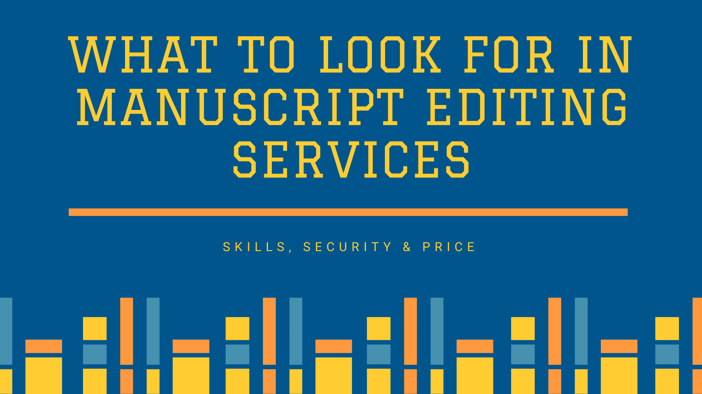

Searching and selecting the best manuscript editing and proofreading service in India, for your manuscript can be an ardent task. There are several manuscript editing service providers in the market and the quality of editing services may vary considerably. 

How to identify and select the best manuscript editing service for your manuscript. Based on our 20 years of experience, we present some salient features of a top manuscript editing service and save your time searching for the right editing service. 
When choosing a manuscript editing service, weigh on the following editing attributes. 

* Strong grammar & eagle-eye for proofreading
* Professional formatting & Track Changes
* Edits to retain author’s voice and style 
* Constructive comments for authors
* Revisions only where necessary
* Alternative suggestions for words & phrases
* Get the right tone
* Bring in logical consistency
* Objective editing 
* And more importantly,  editing fee that is [affordable](https://contentconcepts.in/pricing/) for authors and students. 

And now that you have an idea, how to find whether all these features are covered in the editing service? Well, most of the companies present [manuscript editing samples](https://contentconcepts.in/services/academic_editing/manuscript_editing) on their website. Check the editing samples and decide before you proceed to buy the service.