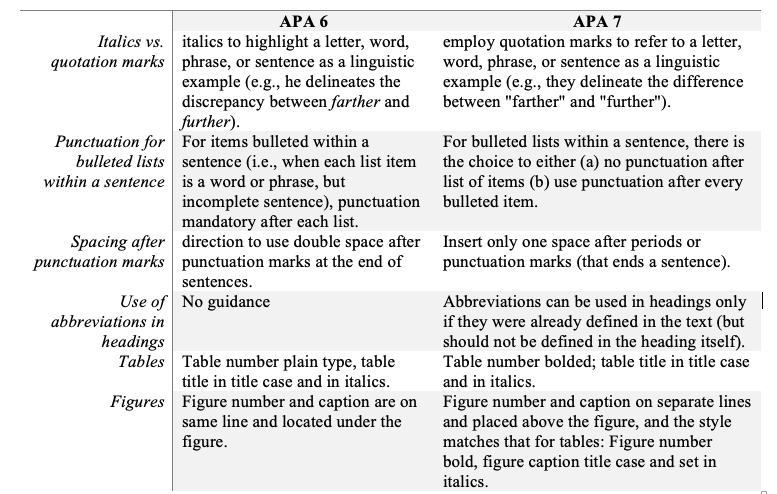

## What's new in APA 7th edition for manuscripts and research papers?

APA style is one of the prominent formats for citing sources. 	
The seventh edition of the APA Publication Manual includes newer updates with the intent to make APA style pertinent for researchers with the focus on sources being cited etc.

Here is s summary of changes in APA 7th Edition.

Book references sans publisher location.
•	Journal articles must now enclose an issue number (if available).
•	20 authors can be included in a reference list instead of just 7.
•	Websites’ URLs can now discount these phrase “Retrieved from” or "Accessed from".

### Source from a database

Books and journal articles retrieved from research databases without DOIs should be referenced as print sources. A journal article retrieved from UpToDate, Cochrane or ERIC, should be referenced with their retrieval date or identification number. 

### Social media

APA 7th includes new examples of social media sites, such as Instagram, Twitter, Facebook and Reddit.
A Tweet is referenced in APA 7 format like this:
Spring, J. \[@jakespring]. (2019, August 220. # The sky never goes dark while the Amazon burns \[Tweet]. Twitter. https://twitter.com/jakespring/status/1164498682387079169
The same can be followed, to cite Facebook, Reddit, Instagram, Tumblr and LinkedIn posts.

### URL

Two updates with respect to URLs, the first one is omitting the wording "Retrieved from” or “Accessed from” before a URL. The second one is the shortening of URLs and DOIs. DOIs can be shortened with the shortDOI service provided by the International DOI Foundation and URLs with any independent shortening service.

### Heading Levels

The big differences are Levels 3 and 4. The other change is that every heading is bold. Every Heading is Title Case. Also, the first heading in the paper, and the heading for the References, are also bold.

### Headings Levels in APA 6 vs APA 7

Many manuscript authors or students writing thesis may not find the time to format thesis or manuscript. In such cases check [APA 7 formatting services online](https://contentconcepts.in/services/publication_support/manuscript_formatting)