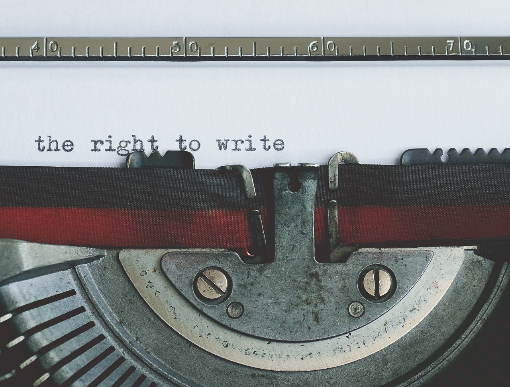

Which is correct - “She’s younger than me” or “she’s younger than I” ? Is it ok to use whom in the place of who? Should you use may or might? Can or could? Well, there is no one right or wrong answer. It depends on where and to whom you write. It’s a fact that bad grammar is invading the social media as well as workspace. But, does grammar really matter anymore, especially in this age of attention scarcity?

Many of us spend a lot of time in informal communication - sending SMS, tweeting about things, responding to friends’ posts on social media. To sound cool and get the message in short time, we write in the way we talk. We don’t care abt grammar or speling. Unfortunately this habit creeps in to workplace and in business documents. Is it ok to be lax when you write emails to your colleagues in SMS lingo? Is it ok to use informal language in your presentations? Heck, I don’t have time, does grammar really matter?

Here are some tips on grammar in the age of Attention Economy and Artificial Intelligence.

**Grammar in business documents & internal emails**

Strictly formal writing but there are exceptions here too. When writing email to your colleagues, a typo or short-form writing is fine as long as it conveys the message, BUT when you think your email may be forwarded to people you may not know, it’s better to tidy up your writing. And when you write to your management better make if formal and stick to the business communication etiquette. Here your reputation is at stake.

When writing business documents, clarity and completeness is key to deliver the right message. Here you are representing your company and not only you. So you know what to do. However, when you are creating a presentation where space is limited you can relax grammar to the extent that it doesn’t drastically change the meaning of your content.

**Grammar in social media**

Brevity is the soul of wit, said the master. On social media you can be creative and cool with your friends using informal lingo. But do not go overboard. If you are looking for a job and all your posts are public the recruiter may see this as one of your profile items. Even on social media, communication is about clarity and not obscure wiring, especially if you talk both work and life.

**Grammar & real estate (space scarcity)**

In communications where real estate is premium such as name boards, standees, marketing collateral, website and PPT, use your discretion and relax grammar rules. Here content and quick communication matters than strict grammar rules. For example you can get rid of articles, vowels and prepositions without affecting the meaning of your message.

Write it right. And enjoy while you are at it. 

Still here? Oh, are you looking for the answer for - Which is correct - “She’s younger than me” or “she’s younger than I” ?. Both are correct, stick to what you feel comfortable using. The latter is old-school style and the ‘than me’ is the modern one.