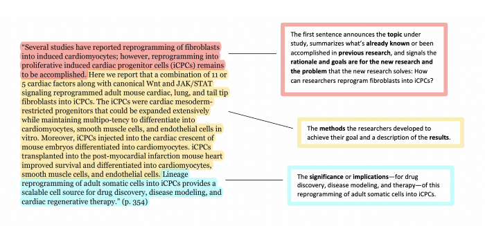

A well-written abstract should be reflective of the overall contents of the research article. By skimming through it, the reader should be able to understand the focus of the work and its relevance to their area of interest, thereby determining whether the full text warrants their attention. It should be succinct, around 200–250 words in length so that the reader is not burdened with too much information, but at the same time effectively convey the crux of the topic. Besides, the abstract should be self-explanatory, that is, the reader should be able to grasp the subject without referring to the main text.

It is always good to start an abstract with appropriate background information on the topic. Some writers plunge headlong into their work, which makes it difficult for a reader to appreciate its context. The key objectives and scope of the research should be revealed. The methodology adopted can be touched upon without delving into the details. The important findings must also be elucidated and their implications briefly discussed. It is desirable to end a well-written abstract with a statement that exemplifies the contributions of the work to the existing literature.

If you need help, check out our suite of [Academic Manuscript Editing Services](https://contentconcepts.in/services/academic_editing)