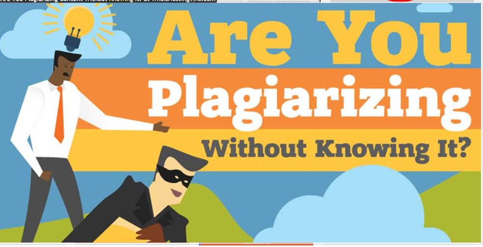

In this modern day, academic plagiarism is mostly unintentional, or self-plagiarism, at least in the papers we receive for manuscript editing. This is because one cannot dodge plagiarism as there are many sophisticated software available to  deduct plagiarism. 

## So what is plagiarism?

 According to the dictionary of Merriam-Webster:

* Plagiarism is not merely stealing words of someone’s text. It is also about stealing the ideas of a person. While paraphrasing something, you need to cite the idea 
* You can paraphrase a particular idea, but you should cite the original source.

## Categories of Plagiarism

There are various forms of plagiarism. At the end of the day, all forms of [plagiarism](https://contentconcepts.in/services/plagiarism_check/plagiarism_editing) boil down to the notion of stealing ideas or text. 

#### Copy-Paste Plagiarism

The other name for this form is direct plagiarism. The person simply copies a portion of the text and pastes it in his document, without any citation. When you require using some text word-by-word, it is important to put it within quotes. 

### Mosaic Plagiarism

It is about creating a patchwork text by copying different small portions of text and pasting them together to artificially create a new text. 

### Self-plagiarism

As the term suggests, you plagiarize the content from your own written text without citing it. It could be an academic paper or data analysis report. Although this might seem a bit weird, but from a practical perspective, you need to produce original work, even avoiding self-plagiarism. 

### Global plagiarism

Global plagiarism is using another person’s academic paper or works in a similar line. Also, when you buy a paper from some service provider, you commit the same mistake. When one of your friends or family members writes the paper under your name, the seriousness of the offense is same. 

## Consequences of plagiarism

The consequences are dependent on the plagiarism type and your stature as a student or researcher. 
•	Failing the coursework 
•	Suspension
•	Infringement of copyright
•	Ending of professional career 

## What universities and various journals say about plagiarism

American universities, entities and journals regard plagiarism as an offence and have various degrees of penalties for the same. 

## Avoiding plagiarism

Two simple steps to follow for [avoiding plagiarism](https://contentconcepts.in/services/plagiarism_check) are:

* Paraphrasing or properly quoting the specific text or the idea
* Giving a citation of the specific text you are using, indicating a source 

## What type of information should you cite?

The information that is common knowledge does not require to be cited. Also, it is important to know your target readers. 

### Different styles for citing sources

There are several academic styles for citing sources, such as APA, MLA and Chicago. 

## Detecting plagiarism

Nowadays, most of the universities and journals use a plagiarism-checker software product called Turnitin. 

### How does a plagiarism checker work?

The two main elements that a plagiarism checker considers are:

* comparing the text with a vast database, and
*  running a plagiarism algorithm. 

### Which is a suitable plagiarism checker?

You can either choose a free platform to check plagiarism or buy a feature-rich checker at a certain cost. Do a comparative analysis of various plagiarism checkers before deciding finally.

[Plagiarism Check and Correction Services](https://contentconcepts.in/services/plagiarism_correction/)

If you don't have time and looking for professional help to remove plagiarism and reduce similarity, there are some [online editing and proofreading services](https://contentconcepts.in/services/academic_editing/manuscript_editing) that specalise in this.