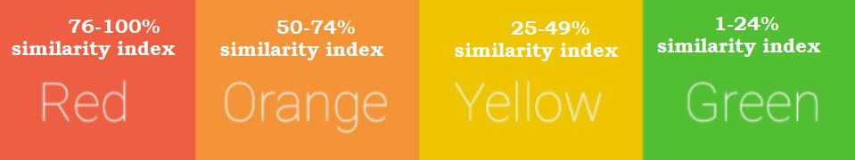

More often than not, manuscript authors hit a roadblock where they are not able to reduce similarity in their manuscript. Understanding how the plagiarism checker tools work will help authors to get ahead. 

### Limitations of Plagiarism Checkers

Plagiarism Checker tools help manuscript authors to check for similarity in their academic content by comparing their content with various online resources (published data, information, articles). However a serious limitation in most of these plagiarism checker tools is the restriction placed on paid content, hence these tools can access ONLY the free or open access content. Many plagiarism checker software do not even fully explore these free contents to match for similarity owing to the settings or architecture of the software, server capacity, internet speeds, other personal browser and PC settings, etc., (especially for contrasting academic content).  

### What Are the Top Plagiarism Checker Tools

1.Turnitin

2 IThenticate

3.PlagiarismCheckerX

4.Grammarly

5.ProWritingAid

The best commercial tool is Turnitin® (Academic version available only for academic institutions), its commercial version for an organization (‘corporate market’) or for an individual is IThenticate® (the industry gold standard and the similarity report acknowledged with no dispute). Individuals can buy credits to check the similarity level for their academic contents, whereas Organizations need to request a quote. 

#### PlagiarismcheckerX

The next best paid software is PlagiarismcheckerX where any author can check for similarity in their content for free but with daily word limits. A Professional license for unlimited use and a Business version are also available. 

It is also to be noted that plagiarism checker tools are provided as paid services via language editing softwares such as Grammarly® and ProWritingAid®. The level of similarity detection work better than free tools but has room for improvement in their detection efficiency compared to the software listed above.  

There are many free tools available to potential authors, some listed below:  

Copyleaks Plagiarism Checker, PaperRater, Dupli Checker, PlagScan, Quetext, Plagiarism Detector (this list not arranged per rank).

### How to interpret the similarity report generated by Plagiarism Checker?

Green < 24% of matched texts. This is an ideal score specifically under the condition that the sources integrated and cited correctly. 

Most scientific journals and varsities prefer similarity under 20%, the lesser the score the better the content in terms of integrity and originality. 

Yellow 25% - 49% of matched text. The academic content would profit from further paraphrasing and analysis. 

Orange 50% - 74% of matched text. The article requires substantial revision. It is imperative to check if the matching text is from one or fewer sources. 

 Red 75% - 100% matched text. Not acceptable work as this is a completely plagiarized work. There is a possibility of a match with an earlier version of the same paper in the repository. It is imperative to check if the matching text is from one or fewer sources.

Similarity scores from 1-5% form single source may be acceptable (under the presumption of no outright copying of text, often could occur in the methods, use of technical term, etc).

## Tips to avoid plagiarism in manuscript

1.Cite the sources, giving due credit to the original author and including text in quotes. (Acknowledgement of the source is mandatory). 

2.Even if sources cited credibly, it is good to completely rewrite the sentences/ paragraph or the content in the academic article. 

3.Trying one's best ability, it is also pertinent to use plagiarism/ similarity checking software.