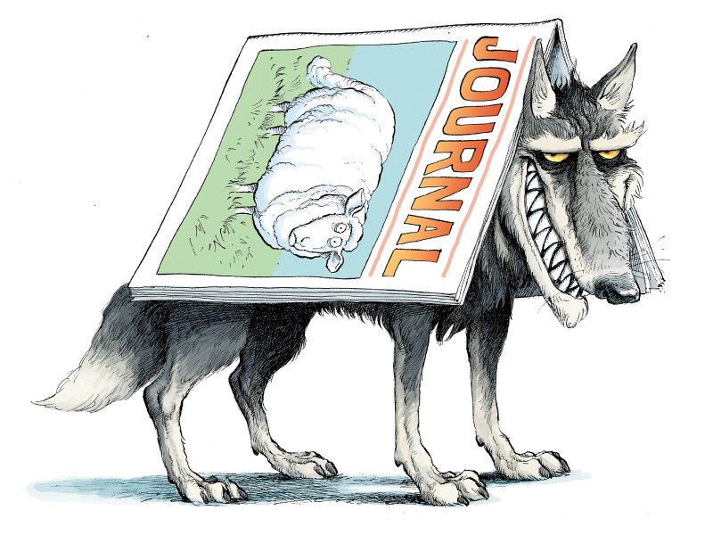

Nowadays, one’s inbox or spam folder deluged with emails soliciting paper submission to journals. These emails are triggered by the recent paper published in a reputed journal, or conference or from email address in projects or other research-related websites. There is also the pressure on budding research to publish with the current research environment adopt “Publish or Perish” policy. Now how to check and know which are legitimate journals, etc. and avoid them. 

## What are predatory journals?

The label ‘predatory journal’ was conceived by Jeffrey Beall (who systematically analysed a growing number of exploitative academic journals charging author fees without proper quality-check (via peer review) of the submitted and published papers). 
https://beallslist.net/

These journals act as predators and contemplate the authors (new or inexperienced), as their prey and lure them with a promise of fast-track peer-review and publish. Authors feel attracted by these guarantees to get their work published rapidly, hence amenable to pay for this service. 
“Predatory journals (also called deceitful or scamming journals) are arraigned of implementing inferior academic standards and practices in their editorial and peer-review processes. They apply poor ethical procedures by skipping peer-review, or do superficial (even bypass internal quality check)”. A novel and newer trend of predatory journals are ‘hijacked journals’; journals impersonating reputed and legitimate journals and purport to be the original journal and cajole the authors to submit to hijacked journals instead of the original. 

## A brief summary on the rise of predatory journals 

Predatory journals gained prominence with the start of the open-access publication concept (pioneered by Hindawi in 1997), due to the bloom of this concept array of new publishers mushroomed and started their journals as online-only, with a grave intentions to capitalise on to make financial profit at the expenses of the publishing system. In 2011, Beall’s list included 18 publishers. By 2016, that number had grown to 923 publishers. The problem had bloomed into a catastrophe. The inclusions based on 52 criteria (Beall), was forced to shut down after almost a decade due to mounting intimidation by various dishonourable publishers. Selected publishers, journals and some also members of the open-access community had objected against Beall’s understanding of predatory journals. Threats of legal proceedings by some of the publishers he had labelled as ‘predatory’ resulted in Beall taking the list down, but amidst the academia, Beall earned a lot of appreciation for his list.
Others apart from Beall list; ‘‘The Journal Blacklist’ available for subscription. A good review of the list is also accessible on the Scholarly Kitchen Blog; anonymous group started the initiative ‘Stop Predatory Journals’ listing some 1,300 possible predatory journals, based on Beall’s list, and the number of inclusions is expanding. Currently in Cabell’s Blacklist there are 12,000 plus so-called predatory journals listed. 
https://predatoryjournals.com/ 
https://thinkchecksubmit.org/

## What do predatory journals perpetuate? 

What are the attributes of a predatory journal? Checklist of the abeyant misconduct, unethical practices, and other behaviours of predatory journal(s): 

* do not follow a standardised peer-review process (no clarity on the process; single/double blind review, etc.)
* may not subject the submission to peer-reviewers or may not apply any editing or improvement of the submission before publishing 
* publish a high number of very low-quality articles and manuscripts  
* publish fake or hoax papers 
* send spam emails to researchers imploring them to contribute  
* list members on editorial boards without their knowledge or permission   
* make up (fake) names of editorial board members or authors or reviewers  
* copy material, design and advertise as reputed and legitimate journal 
* hijack credible journals by setting up journals with identical names and similar websites  
* inappropriately or fraudulently use ISSN  
* make up or fake journal metrics such as impact factors and others  
* state wrong or misleading information about the size and the location of the publisher  
* no doi (Digital Object Identifier) for the published article 
  additionally 
* include fake or fraudulent metrices (misleading impact factor) and other such scores (considered credible and important for author)
* include less or unknown or fake indexing services 

  ## Why it is paramount to avoid predatory journals?

  All the features listed above should provide enough reasons to for an ethical and respected scholar not consider publishing in any of the predatory journals. Yet many, notably, young and inexperienced researchers who feel the pressure to publish papers still fall prey to these journals. Pitfalls of publishing in a predatory journal 
* one might get charged for publishing the paper (without any information available in the website about APC/ open access/ Hybrid).
* after acceptance of one’s paper – charge fee to publish (without prior information on APC \[Article processing charges] or Open access policy options.
* paper eventually will not be accessible/ available in the future due to poor long-term storage facility/ website/ domain leasing. 
* credibility as a scholar/ researcher can be damaged by publishing in these journals.
* Also, not useful for finding and attracting research grants or academic positions.