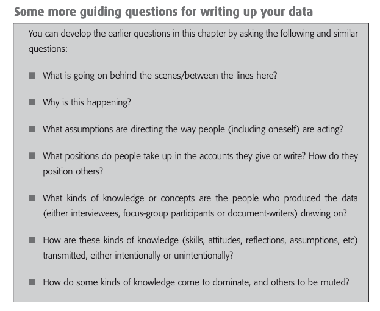

You have collected a lot of data but wondering how to analyse, interpret and present the findings in an interesting and meaningful way. Here are some tips that will help you analyse your qualitative data and write it convincingly.

## Why analyse data?

"Why not just present, verbatim, the data that you collect or source? Why not let the data ‘speak for themselves’? The simple answer is that it won’t speak for itself if left in the form in which you collect it – recordings, or pages of transcripts, or documents of one kind or another. These raw data do not constitute the findings of the research."

Read more about the strategy here in Anne B. Ryan in the chapter ***[Methodology: analysing qualitative data and writing up your findings](http://mural.maynoothuniversity.ie/871/1/methodology.pdf)***