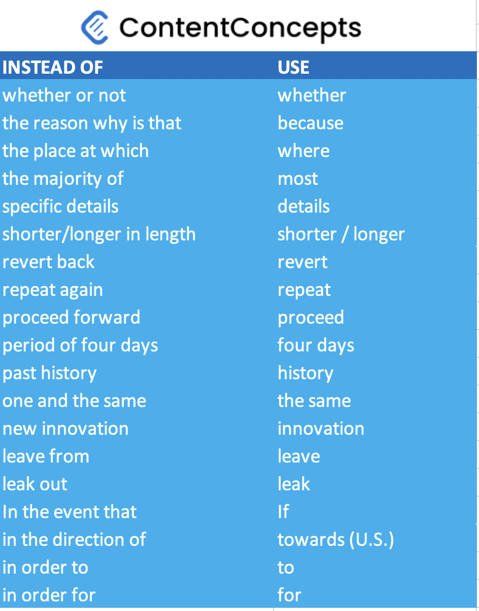

According to our editors and proofreaders, most of the manuscripts, be it for research journals or books, have one common major problem - long sentences and redundant words. 

This can be fixed easily with a little bit of help from your editor or going through writing tips. 

To start with, here are some words you can avoid and instead use the right word. This will result in a crisper and more clear document. 

### Avoid these phrases and get better at writing

Research is about presenting facts and is not concerned with what we feel, think or believe. So avoid words such as :

* we feel...
* we think...
* we believe...
* we hope...

Here are more such [words that you can avoid in academic writing](https://drsaraheaton.wordpress.com/2016/01/18/12-phrases-to-avoid-in-your-academic-research-papers/) of research papers manuscripts and book manuscripts