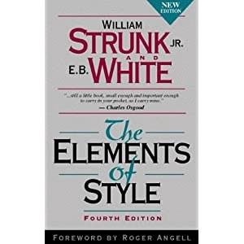
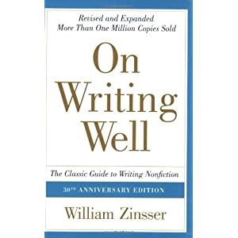

We all have fumbled and continue to when it comes to writing. Be it a simple email or a comprehensive business proposal or a complex project report, we all fret at times. English language is beautiful but twisty at times and the grammar is beyond comprehension for most of us Indians. Fear not, even the native English speakers find it difficult to write with perfect grammar.

Here are some books that will definitely help you improve your writing skills by leaps and bounds. The list is not only for novice but experienced writers also find it very useful.

This is a must-read and must-have book on every writer’s list. You can find the best explanation of basic rules of writing ever written. No, this is not a boring grammar book; it contains very informative chapters on rules and usage of writing in English.

Here is what you can look forward to in this book:

* \- Eight rules of usage
* \- Ten rules of composition
* \- List of commonly misused/misspelled words
* \- Beautiful explanation on sentence structure and parallelism
* \- And many more.

Here is an example from the section “WORDS AND EXPRESSIONS COMMONLY MISUSED”

> **Compare.** To compare to is to point out or imply resemblances, between objects regarded as essentially of 
> different order; to compare with is mainly to point out differences, between objects regarded as essentially of 
> the same order. Thus life has been compared to a pilgrimage, to a drama, to a battle; Congress may be compared
> with the British Parliament. Paris has been compared to ancient Athens; it may be compared with modern London.

This book is carefully revised and polished over several editions. If you have a passion for clear and concise writing, go buy the book.

### 2. On Writing Well, by William Zinsser

This book has sold more than 1.5 million copies. Willaim Zinsser is writer, editor and teacher who has written 18 books so far, mostly on writing.

“Clutter is the disease of American writing. We are a society strangling in unnecessary words, circular constructions, pompous frills and meaningless jargon,” says Zinsser.

If you want a personal writing coach, this is the book. The first part of the book deals with principles, simplicity, usage, clutter and the audience.

The second part covers how to apply the learning in the first part — structuring sentences and paragraphs.

The third part covers different forms of writing — reporting, travel writing, science writing, etc.

To summarize, this book teaches you how to write for different audiences by adapting different tone and style in the writing.

Originally published at [http://content2o.wordpress.com](http://content2o.wordpress.com)
