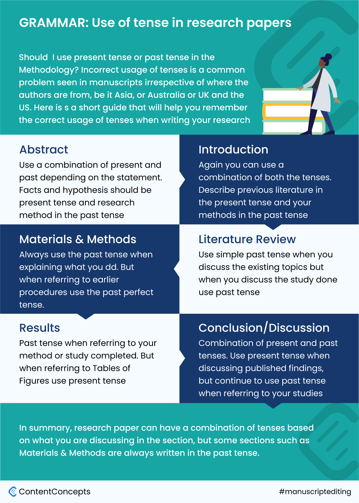

Usage of verb tenses in research papers is a tricky thing that even most seasoned authors may finding it confusing. 

There are some rules and at many times it also depends on the context when and where you are discussing your research.

For example, in the Abstract section authors can use a mix of present and past tenses but in the Materials and Methods section it would be past tense mostly. 

To help you remember what tense to use in a research paper, we have prepared a handy inforgraphic that illustrates tenses recommended for different sections of a research paper or manuscript or in science writing generally.

If you do not have time to review or edit your manuscript or need a professional manuscript editing services, you can check [online manuscript editing services in India](https://contentconcepts.in/services/academic_editing/manuscript_editing)

