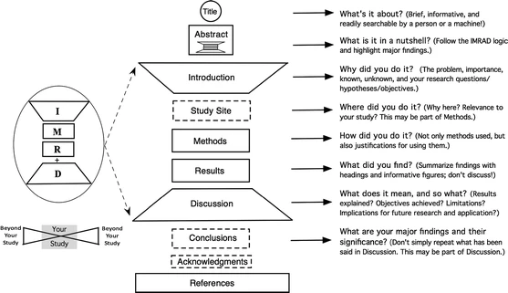

Firstly, let's accept that good writing is a result of hard work. There are no shortcuts to clean and effective writing. However, there are some methods in scientific writing that an author can practice to become a better writer and write better manuscripts.

A journal editor, will look for the following things from your manuscript so that it is considered for publishing in that journal

**1.**The [manuscript](https://contentconcepts.in/services/academic_editing/manuscript_editing) should originate from a methodically correct research that is relevant to the theme of the journal

**2.**Clarity, conciseness, and a logical sequence in the presentation of facts and arguments, to ensure continuity of reading.

**3.**The IMRAD structure - Your paper should follow the Introduction – Method – Results – and – Discussion (IMRAD) structure.

More on [what the journal editor expects from a manuscript](https://www.sciencedirect.com/science/article/pii/S1808869414000743?via%3Dihub)

### Related posts:

\- [What Makes Manuscript Writing Hard and How to Make It Easier](https://contentconcepts.in/blog/what-makes-manuscript-writing-hard-and-how-to-make-it-easier/)

\- [How to write titles for research papers and manuscripts?](https://contentconcepts.in/blog/how-to-write-titles-for-research-papes-and-manuscripts/)

\- [How to write an effective abstract for research papers?](https://contentconcepts.in/blog/how-to-write-an-effective-abstract-for-research-papers/)

